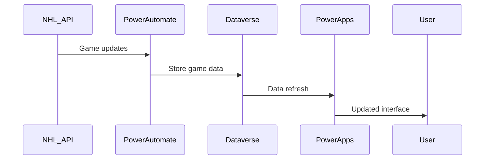
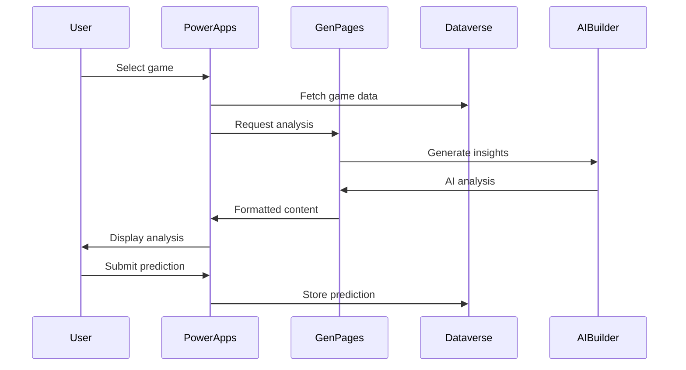
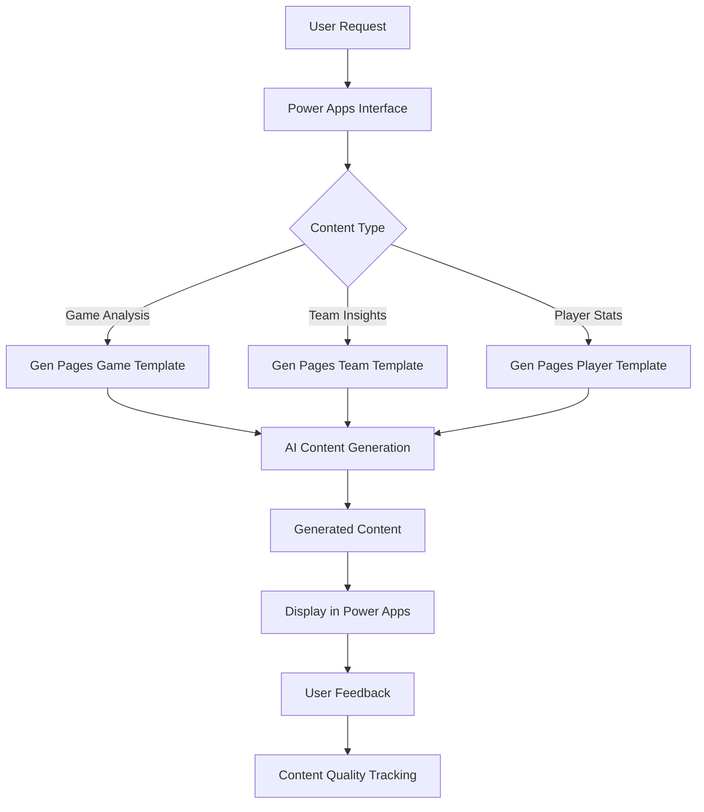

# Architecture Overview - NHL Predictor Game

This document provides a comprehensive overview of the NHL Predictor Game architecture, including system design, data flows, integration patterns, and technical considerations.

## System Architecture

### High-Level Architecture Diagram

```
┌─────────────────────────────────────────────────────────────────┐
│                        User Interface Layer                      │
├─────────────────────────────────────────────────────────────────┤
│  Power Apps Canvas App          │  Power Apps Model-Driven App  │
│  ├─ Game Predictions           │  ├─ Data Management           │
│  ├─ Team Information           │  ├─ User Administration       │
│  ├─ Leaderboards              │  ├─ System Configuration      │
│  ├─ AI Insights (Gen Pages)   │  └─ Reporting & Analytics     │
│  └─ Mobile Interface          │                                │
└─────────────────────────────────────────────────────────────────┘
                              │
                              ▼
┌─────────────────────────────────────────────────────────────────┐
│                      Business Logic Layer                       │
├─────────────────────────────────────────────────────────────────┤
│  Power Automate Flows          │  AI Builder Models            │
│  ├─ Data Synchronization       │  ├─ Prediction Models         │
│  ├─ Notification System        │  ├─ Sentiment Analysis        │
│  ├─ Scheduled Data Updates     │  └─ Content Generation        │
│  └─ Integration Workflows      │                                │
└─────────────────────────────────────────────────────────────────┘
                              │
                              ▼
┌─────────────────────────────────────────────────────────────────┐
│                        Data Layer                               │
├─────────────────────────────────────────────────────────────────┤
│                      Microsoft Dataverse                        │
│  ├─ Teams & Players           │  ├─ Security & Compliance      │
│  ├─ Games & Statistics        │  ├─ Audit & Change Tracking    │
│  ├─ Predictions & Results     │  ├─ Business Rules             │
│  └─ User Data & Preferences   │  └─ Data Validation            │
└─────────────────────────────────────────────────────────────────┘
                              │
                              ▼
┌─────────────────────────────────────────────────────────────────┐
│                    External Integration Layer                   │
├─────────────────────────────────────────────────────────────────┤
│  NHL Official API             │  Third-Party Sports APIs       │
│  ├─ Game Schedules            │  ├─ Advanced Statistics        │
│  ├─ Live Scores               │  ├─ Player Analytics           │
│  ├─ Team Information          │  ├─ Injury Reports             │
│  └─ Player Statistics         │  └─ News & Updates             │
└─────────────────────────────────────────────────────────────────┘
```

## Core Components

### 1. User Interface Layer

#### Power Apps Canvas App
- **Primary User Interface**: Main application for end users
- **Responsive Design**: Optimized for desktop, tablet, and mobile
- **Real-time Updates**: Dynamic content loading and refresh
- **AI Integration**: Embedded Gen Pages for intelligent insights

#### Power Apps Model-Driven App
- **Administrative Interface**: System configuration and management
- **Data Management**: Bulk operations and data maintenance
- **Reporting**: Advanced analytics and business intelligence
- **User Management**: Role-based access control

### 2. Business Logic Layer

#### Power Automate Flows
```
Data Synchronization Flows:
├─ NHL API Data Sync (Scheduled)
├─ Real-time Score Updates (Triggered)
├─ Player Statistics Update (Daily)
└─ Season Schedule Import (Weekly)

Notification Flows:
├─ Game Prediction Reminders
├─ Score Update Notifications  
├─ Weekly Performance Summary
└─ Prediction Result Notifications

Integration Flows:
├─ External API Connectors
├─ Email Integration
├─ Teams Integration
└─ SharePoint Document Management
```

#### AI Builder Integration
- **Prediction Models**: Machine learning models for game outcome prediction
- **Sentiment Analysis**: User comment and feedback analysis
- **Content Generation**: AI-powered insights and analysis through Gen Pages

### 3. Data Layer Architecture

#### Dataverse Table Structure
```
Core Tables:
├─ nhl_team (Teams)
│  ├─ Basic team information
│  ├─ Current roster links
│  └─ Historical data
├─ nhl_player (Players)  
│  ├─ Player demographics
│  ├─ Career statistics
│  └─ Team associations
├─ nhl_game (Games)
│  ├─ Game details and scores
│  ├─ Team matchups
│  └─ Game statistics
├─ nhl_prediction (Predictions)
│  ├─ User predictions
│  ├─ Confidence levels
│  └─ Results tracking
└─ nhl_teamstats (Team Statistics)
   ├─ Season statistics
   ├─ Performance metrics
   └─ Calculated fields

Relationship Structure:
Teams (1) ←→ (Many) Players
Teams (1) ←→ (Many) Games (Home)
Teams (1) ←→ (Many) Games (Away)  
Games (1) ←→ (Many) Predictions
Users (1) ←→ (Many) Predictions
```

## Data Flow Patterns

### 1. Real-time Data Synchronization



### 2. Prediction Workflow



### 3. Content Generation Flow



## Security Architecture

### Authentication and Authorization

```
Security Layers:
├─ Azure Active Directory Integration
│  ├─ Single Sign-On (SSO)
│  ├─ Multi-Factor Authentication (MFA)
│  └─ Conditional Access Policies
├─ Power Platform Security Roles
│  ├─ NHL Predictor User
│  ├─ NHL Predictor Admin
│  └─ NHL Data Manager
└─ Dataverse Security Model
   ├─ Table-level permissions
   ├─ Field-level security
   └─ Business unit hierarchy
```

### Data Protection and Compliance

```
Compliance Framework:
├─ Data Loss Prevention (DLP)
│  ├─ Connector policies
│  ├─ Data classification
│  └─ Cross-tenant restrictions
├─ Audit and Monitoring
│  ├─ User activity tracking
│  ├─ Data access logging
│  └─ Change history
└─ Privacy Controls
   ├─ Data retention policies
   ├─ User consent management
   └─ Data export capabilities
```

## Integration Patterns

### 1. NHL API Integration

```powerfx
// Custom connector configuration
NHLConnector: {
    BaseURL: "https://statsapi.web.nhl.com/api/v1/",
    Endpoints: {
        Teams: "teams",
        Schedule: "schedule",
        GameFeed: "game/{id}/feed/live",
        Standings: "standings"
    },
    RateLimit: "60 requests/minute",
    Authentication: "None (public API)"
}
```

### 2. Power Automate Integration Patterns

```yaml
Data Sync Pattern:
  Trigger: Scheduled (Every 15 minutes during game time)
  Actions:
    - Get active games from NHL API
    - Parse JSON response  
    - Update Dataverse game records
    - Trigger score update notifications
  Error Handling:
    - Retry logic for API failures
    - Fallback to cached data
    - Admin notification for persistent failures
```

### 3. Gen Pages Integration

```powerfx
// Gen Pages configuration for game analysis
GameAnalysisConfig: {
    Template: "NHL Game Analysis",
    DataSources: [
        "Teams", "Games", "TeamStats", "Players"
    ],
    OutputFormat: "HTML",
    RefreshPattern: "On-demand",
    CacheExpiry: "1 hour"
}
```

## Performance Considerations

### Scalability Patterns

```
Performance Optimization:
├─ Data Layer
│  ├─ Proper indexing on frequently queried columns
│  ├─ Data archiving for historical seasons
│  ├─ Calculated columns for derived statistics
│  └─ Views for complex queries
├─ Application Layer  
│  ├─ Lazy loading for large datasets
│  ├─ Client-side caching strategies
│  ├─ Optimized Power Fx formulas
│  └─ Minimal data transfer patterns
└─ Integration Layer
   ├─ API rate limiting and throttling
   ├─ Batch processing for bulk operations
   ├─ Asynchronous processing patterns
   └─ Connection pooling
```

### Monitoring and Diagnostics

```
Monitoring Strategy:
├─ Power Platform Analytics
│  ├─ App usage metrics
│  ├─ Performance monitoring
│  └─ Error tracking
├─ Dataverse Metrics
│  ├─ Storage utilization
│  ├─ API call volumes
│  └─ Query performance
└─ Custom Telemetry
   ├─ User behavior tracking
   ├─ Prediction accuracy metrics
   └─ AI content quality scores
```

## Deployment Architecture

### Environment Strategy

```
Environment Hierarchy:
├─ Development Environment
│  ├─ Individual developer instances
│  ├─ Feature development and testing
│  └─ Sample data sets
├─ Test Environment
│  ├─ Integration testing
│  ├─ User acceptance testing  
│  └─ Performance testing
├─ Staging Environment
│  ├─ Pre-production validation
│  ├─ Production data subset
│  └─ Final integration testing
└─ Production Environment
   ├─ Live user access
   ├─ Real-time data feeds
   └─ Full monitoring and backup
```

### Continuous Integration/Deployment

```yaml
CI/CD Pipeline:
  Source Control: Git repository
  Build Process:
    - Solution export from dev environment
    - Automated testing execution
    - Security and compliance validation
  Deployment Process:
    - Automated solution import
    - Data migration scripts
    - Environment-specific configuration
    - Smoke testing
  Rollback Strategy:
    - Previous version backup
    - Quick rollback procedures
    - Impact assessment protocols
```

## Disaster Recovery and Business Continuity

### Backup Strategy

```
Backup Framework:
├─ Dataverse Backup
│  ├─ Daily automated backups
│  ├─ Point-in-time recovery
│  └─ Cross-region replication
├─ Solution Backup
│  ├─ Version-controlled solutions
│  ├─ Configuration backups
│  └─ Custom component preservation
└─ Data Export
   ├─ Regular data exports
   ├─ External storage integration
   └─ Compliance data retention
```

### Recovery Procedures

```
Recovery Time Objectives (RTO):
├─ Critical Functions: 4 hours
├─ Standard Functions: 24 hours  
└─ Historical Data: 72 hours

Recovery Point Objectives (RPO):
├─ Live Game Data: 15 minutes
├─ User Predictions: 1 hour
└─ Historical Statistics: 24 hours
```

## Cost Optimization

### Licensing Optimization

```
License Usage Strategy:
├─ Power Apps Per-User vs Per-App licensing
├─ Dataverse storage optimization
├─ AI Builder consumption management
└─ Power Automate run optimization
```

### Resource Management

```
Cost Control Measures:
├─ Environment lifecycle management
├─ Automated resource cleanup
├─ Usage monitoring and alerting
└─ Capacity planning and forecasting
```

---

**Previous:** [← Gen Pages Implementation](04-gen-pages-implementation.md) | **Next:** [Configuration Examples →](06-configuration-examples.md)